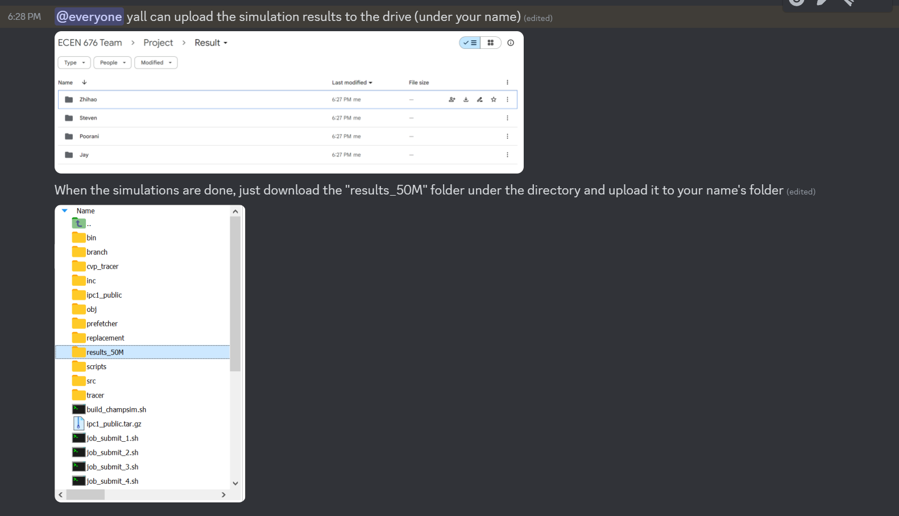

# ECEN676-Project-Group9
Fall 2024 ECEN676 Project Group9

run this command: 

    git clone --branch FDIP_master https://github.com/ChampSim/ChampSim.git

download the traces from here https://drive.google.com/file/d/1qs8t8-YWc7lLoYbjbH_d3lf1xdoYBznf/view

upload the ipc1_public.tar.gz to the ChampSim folder

run this command:

    tar -xzvf ipc1_public.tar.gz

Go to run_champsim.sh and change line 9 to:

    TRACE_DIR=$PWD/ipc1_public

There is a need to modify the bimodal.bpred, which is change line 24 into this: 

    void O3_CPU::last_branch_result(uint64_t ip, uint8_t taken, uint64_t target, uint8_t branch_type)

Your bimodal.bpred would look like this:

    #include "ooo_cpu.h"

    #define BIMODAL_TABLE_SIZE 16384
    #define BIMODAL_PRIME 16381
    #define MAX_COUNTER 3
    int bimodal_table[NUM_CPUS][BIMODAL_TABLE_SIZE];

    void O3_CPU::initialize_branch_predictor()
    {
        cout << "CPU " << cpu << " Bimodal branch predictor" << endl;

        for(int i = 0; i < BIMODAL_TABLE_SIZE; i++)
            bimodal_table[cpu][i] = 0;
    }

    uint8_t O3_CPU::predict_branch(uint64_t ip)
    {
        uint32_t hash = ip % BIMODAL_PRIME;
        uint8_t prediction = (bimodal_table[cpu][hash] >= ((MAX_COUNTER + 1)/2)) ? 1 : 0;

        return prediction;
    }

    void O3_CPU::last_branch_result(uint64_t ip, uint8_t taken, uint64_t target, uint8_t branch_type)
    {
        uint32_t hash = ip % BIMODAL_PRIME;

        if (taken && (bimodal_table[cpu][hash] < MAX_COUNTER))
            bimodal_table[cpu][hash]++;
        else if ((taken == 0) && (bimodal_table[cpu][hash] > 0))
            bimodal_table[cpu][hash]--;
    }

Go to the folder "prefetcher" and upload the Entangling_2Ke.l1i_pref, Entangling_4Ke.l1i_pref, or Entangling_8Ke.l1i_pref to the folder.

Run this command to build:

    ./build_champsim.sh bimodal Entangling_2Ke no no no lru 1

or

    ./build_champsim.sh bimodal Entangling_4Ke no no no lru 1

or

    ./build_champsim.sh bimodal Entangling_8Ke no no no lru 1

or

    ./build_champsim.sh bimodal next_line no no no lru 1

or

    ./build_champsim.sh bimodal no no no no lru 1

After build successful, sbatch the job_submits, the job scripts are under the job folder

Don't forget to change my email to your email in the scripts!

Upload results:

Simulations:

Jay - Entangling_8Ke

Steven - Entangling_4Ke

Zhihao - no and Entangling_2Ke

Poorani - next_line
